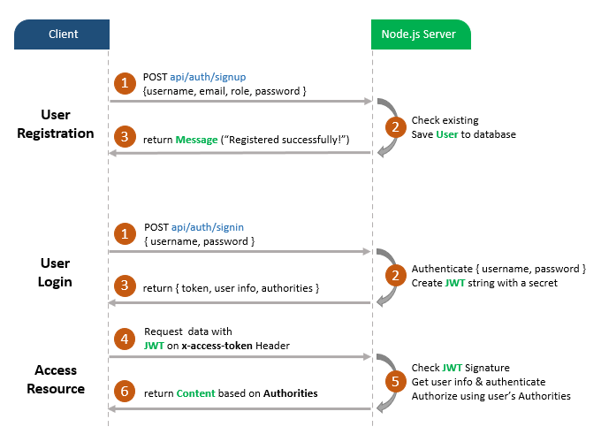
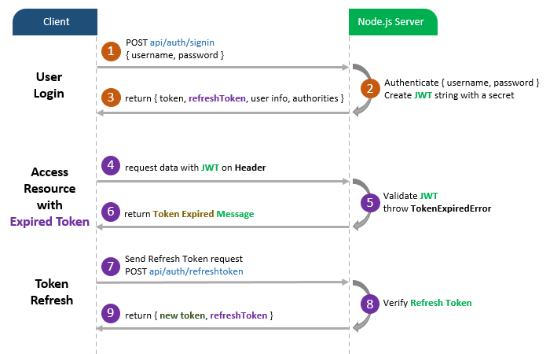

# node-js-jwt-refresh-token-mongodb

Free Open source REST API built with | Nodejs + Express + Mongodb ⚡️ Made with developer experience first Prettier + VSCode setup.

> - C.R.U.D, Filter, Paginate, Sort and Search API

## Table of contents

- [Overview](#overview)
  - [Author](#author)
  - [The challenge](#the-challenge)
  - [Links](#links)
- [My Process](#my-process)
  - [Built with](#built-with)
  - [What I Learnt](#what-i-learnt)
  - [Continued Development](#continued-development)
  - [Useful Resources](#useful-resources)
- [API Reference](#api-reference)
- [Contributions](#contributions)
- [Status](#status)
- [The Challenge](#the-challenge)
- [Environment Variables](#environment)
- [Deployment](#deployment)
- [Related Projects](#related-projects)
- [Support](#support)
- [Feedback](#feedback)
- [Run Locally](#run-locally)
- [Status](#status)
- [Screenshots](#screenshots)

## Overview

### Author

#### <a href="https://github.com/fentonMiyare">@FentonMiyare</a>

### The Challenge

Users should be able to:

- Complete user authentication
- Sign in
- Sign out
- Verify email
- Change Password
- Make orders
- Search for writers
- Checkout total payment
- Checkout order page

Writers should, (on top of user role) be able to:

- Complete Writer Authorization
- Add orders
- Add Users
- View all orders
- View order details
- Filter orders by category
- Bid for available orders
- Order pagination

Admins should, (on top of user and writer roles) be able to:

- Complete Admin Authorization
- Add orders
- Update orders
- Delete orders
- Limit orders
- Add Users
- Update Users
- Delete Users
- Update User Role

### Links

> [LIVE CRUD REST API Demo](https://fentonmiyare-rest-api.herokuapp.com)

#### For Testing, use:

- Username: `user1`
- Password: `Abc123##`

## My Process

### Built with:

> Node.js

> Joi 17.7.0

> Heroku Hosting

> cors 2.8.5

> express 4.18.2

> cookie-session 2.0.0

> bcryptjs 2.4.3

> jsonwebtoken 9.0.0

> mongoose 5.13.15

> uuid 9.0.0

> MongoDB

> Redis 4.6.5

> Mocha 10.2.0

### `What I Learnt`

I learnt a great deal of server side data validation, error handling and basically not trusting user inputs.

### `Continued Development`

I'm putting in more effort to master the backend development using various technolgies. Also trying to adapt to some of the leading solution for building serverless applications

### `Useful Resources`

- [Resource 1 - API Best Practices](https://www.freecodecamp.org/news/rest-api-design-best-practices-build-a-rest-api/) - This is an helpful article that provides simple examples which helps in understanding the core API concepts without lots of complexity. It should give you a direction to make your API's better in terms of user experience (consumer and developers), security and performance.
- [Resource 2 - API Best Practices](https://www.freecodecamp.org/news/rest-api-design-best-practices-build-a-rest-api/) -

## API Reference

#### Get all Orders

```http
  GET https://fentonmiyare-rest-api.herokuapp.com/api/v1/orders
```

| Parameter  | Type     | Description           |
| :--------- | :------- | :-------------------- |
| `limit`    | `number` | default= 100          |
| `category` | `string` | default= All Products |
| `page`     | `number` | default= 1            |
| `search`   | `string` | search string         |
| `sortBy`   | `string` | default= createdAt    |
| `OrderBy`  | `string` | default= desc         |

#### example (Paginate - Sort - Filter - Full-text search)

```http
  GET https://fentonmiyare-rest-api.herokuapp.com/api/v1/orders?page=1&limit=99&sortBy=createdAt&OrderBy=desc&filterBy=category&category=Article Writing
  GET   https://fentonmiyare-rest-api.herokuapp.com/api/v1/orders?page=2&limit=99&sortBy=createdAt&OrderBy=desc&filterBy=category&category=Coursework
  GET   https://fentonmiyare-rest-api.herokuapp.com/api/v1/orders?page=2&limit=99&sortBy=createdAt&OrderBy=desc&filterBy=category&category=History&search=nodejs
```

#### Get single order

```http
  GET https://fentonmiyare-rest-api.herokuapp.com/api/v1/orders/${id}
```

| Parameter | Type     | Description                        |
| :-------- | :------- | :--------------------------------- |
| `id`      | `string` | **Required**. Id of order to fetch |

#### Add new order

```http
  POST https://fentonmiyare-rest-api.herokuapp.com/api/v1/admin/orders
```

| Parameter         | Type     | Description                     |
| :---------------- | :------- | :------------------------------ |
| `title`           | `string` | **Required**. order title       |
| `work`            | `number` | **Required**. order work        |
| `format`          | `string` | **Required**. order format      |
| `spacing`         | `img`    | **Required**. order spacing     |
| `category`        | `string` | **Required**. order category    |
| `pages`           | `number` | **Optional**. default value = 1 |
| `deadline       ` | `string` | **Optional**. order deadline    |

#### Update order (Only admins)

```http
  PATCH https://fentonmiyare-rest-api.herokuapp.com/api/v1/admin/orders/${id}
```

| Parameter | Type     | Description                             |
| :-------- | :------- | :-------------------------------------- |
| `id`      | `string` | **Required**. Id of product to update   |
| `token`   | `string` | **Required**. JWT token pass in headers |

#### Delete order (Only admins)

```http
  DELETE https://fentonmiyare-rest-api.herokuapp.com/api/v1/admin/orders/${id}
```

| Parameter | Type     | Description                             |
| :-------- | :------- | :-------------------------------------- |
| `id`      | `string` | **Required**. Id of product to delete   |
| `token`   | `string` | **Required**. JWT token pass in headers |

#### User signup

```http
  POST https://fentonmiyare-rest-api.herokuapp.com/api/v1/auth/signup
```

| Parameter         | Type      | Description   |
| :---------------- | :-------- | :------------ |
| `username`        | `string`  | **Required**. |
| `email`           | `string`  | **Required**. |
| `password`        | `string`  | **Required**. |
| `confirmPassword` | `string`  | **Required**. |
| `dateOfBirth`     | `string`  | **Optional**. |
| `acceptTerms`     | `boolean` | **Required**. |
| `mobileNumber`    | `number`  | **Optional**. |
| `nationality`     | `string`  | **Optional**. |
| `favoriteAnimal`  | `string`  | **Optional**. |
| `address`         | `string`  | **Optional**. |
| `bio`             | `string`  | **Optional**. |
| `jobTitle`        | `string`  | **Optional**. |

```http
  After signup you will receive email to verify your account
```

#### User Login

```http
  POST https://fentonmiyare-rest-api.herokuapp.com/api/v1/auth/login
```

| Parameter  | Type     | Description   |
| :--------- | :------- | :------------ |
| `email`    | `string` | **Required**. |
| `password` | `string` | **Required**. |

#### User Verify Email

```http
  POST https://fentonmiyare-rest-api.herokuapp.com/api/v1/auth/verify-email`,
```

| Parameter | Type     | Description   |
| :-------- | :------- | :------------ |
| `userId`  | `string` | **Required**. |
| `token`   | `string` | **Required**. |

#### **User Registration, User Login and Authorization process.**

The diagram shows flow of how we implement User Registration, User Login and Authorization process.



And this is for Refresh Token:



## Environment

To run this project, you will need to add the following environment variables to your .env file (check environment.config.js file for more examples):

> MONGODB_CONNECTION_STRING

> TOKEN_SECRET

> WEBSITE_URL

> API_VERSION = v1

> JWT_EXPIRE_TIME

> SEND_GRID_API_KEY

> ADMIN_SEND_GRID_EMAIL

> ADMIN_ROLE

> ADMIN_EMAIL

> NODE_ENV = development

> CLIENT_URL

> ACCESS_TOKEN_SECRET_KEY

> REFRESH_TOKEN_SECRET_KEY

> ACCESS_TOKEN_KEY_EXPIRE_TIME

> REFRESH_TOKEN_KEY_EXPIRE_TIME

## Contributions

Contributions are always welcome!

## Deployment

To deploy this project on Heroku Flow the Flowing documentation <a href="https://devcenter.heroku.com/articles/deploying-nodejs">Deploying Node.js Apps on Heroku</a>

## Related Projects

### API Projects built with | Nodejs + Express + Mongodb

<!-- #### <a href="https://blog-post-api-sadam.herokuapp.com">LIVE API</a>

#### <a href="https://github.com/saddamarbaa/blog-api">API REPO</a>

#### <a href="https://github.com/saddamarbaa/blog-post-front-end-vanillaJS">Front-End REPO</a>

#### <a href="https://saddamarbaa-blog.netlify.app/"> LIVE Webside DEMO </a>

### Twitter API built with | Nodejs + Express + Mongodb

#### <a href="https://twitter-clone-app-saddam.herokuapp.com/">LIVE API Demo</a>

#### <a href="https://github.com/saddamarbaa/twitter-clone-api">API REPO</a>

#### <a href="https://github.com/saddamarbaa/twitter-clone-app">Front-End REPO</a>

#### <a href="https://twitter-clone-saddam.netlify.app/">LIVE Webside DEMO </a>

### Netflix API built with | Nodejs + Express + Mongodb

#### <a href="https://github.com/saddamarbaa/netflix-clone-api">API REPO</a>

#### <a href="https://nefilx-saddam.herokuapp.com/">LIVE API Demo</a> -->

## Support

For support, email makavelimiyare88@gmail.com.

## Feedback

If you have any feedback, please reach out to me at fentonwebdev@gmail.com

Linkedin.
https://www.linkedin.com/in/FentonMiyare/

Github
https://github.com/FentonMiyare

Facebook
https://www.facebook.com/fenton.miyare

## Run Locally

Clone the project

```bash
https://github.com/fentonmiyare/JWT RefreshTokenAuth
```

Go to the project directory

```bash
  cd JWT RefreshTokenAuth
```

Install dependencies

```bash
yarn install
# or
npm install
```

Start the server

```bash
  node server.js
  or
  nodemon server.js
```

## Status

Project is: in progress I'm working on it in my free time

## Screenshots

### Signup Page


### LogIn Page


### Forgot Password Page


### Home Page


### Orders Page 1


### Orders Page 2


### Active State Orders Page


### Admin Page


### Writers Page


### Users Page


### Signed In Users Page


### Signed In Users Profile Page


### Users Page


# 20230505-NodeJs_JWT_Redis_Project
